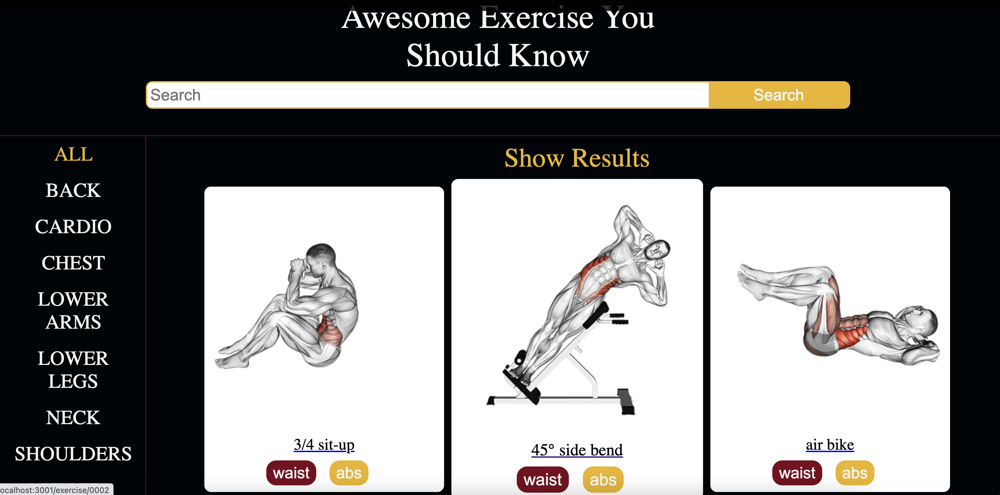
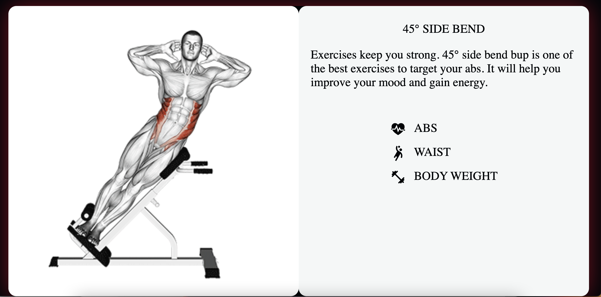

# Fitness App

[Try Fitness App](https://github.com/muzaffercankaplan/Fitness-App)

---

### Home Page

## Exercise Page

## Exercise Detail Page

## Installation Instructions

1.  Clone or download the project:

        git clone https://github.com/muzaffercankaplan/Fitness-App.git

2.  Go to the project directory and install the requirements:

        cd fitness-app
        npm i

3.  Start the application:

        npm start
